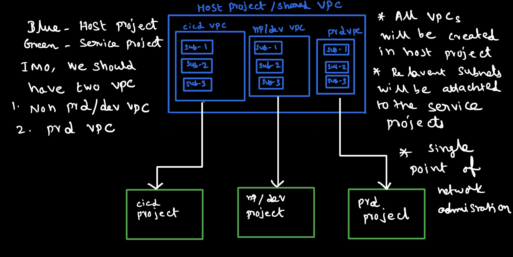

# Shared VPC


## VPC Peering Setup



## Shared VPCs in Host Project

| Project             | VPC Name           | Subnet-1    |
|---------------------|--------------------|-------------|
| gnanam-host-project | dev-service-1-svpc | 10.0.1.0/24 |
| gnanam-host-project | prd-service-1-svpc | 10.0.2.0/24 |
| gnanam-host-project | cicd-monitor-svpc  | 10.0.3.0/24 |

## Shared VPC Commands
```shell
gcloud config set project gnanam-host-project

gcloud compute networks create dev-service-1-svpc --subnet-mode=custom
gcloud compute networks subnets create dev-service-1-subnet-asia-southeast1 --network=dev-service-1-svpc --region=asia-southeast1 --range=10.0.1.0/24

gcloud compute networks create prd-service-1-svpc --subnet-mode=custom
gcloud compute networks subnets create prd-service-1-subnet-asia-southeast1 --network=prd-service-1-svpc --region=asia-southeast1 --range=10.0.2.0/24

gcloud compute networks create cicd-monitor-svpc --subnet-mode=custom
gcloud compute networks subnets create cicd-monitor-subnet-asia-southeast1 --network=cicd-monitor-svpc --region=asia-southeast1 --range=10.0.3.0/24

gcloud compute firewall-rules   create dev-service-1-fw-ssh-allow --direction=INGRESS --priority=1000 --network=dev-service-1-svpc --action=ALLOW --rules=tcp:22 --source-ranges=0.0.0.0/0
gcloud compute firewall-rules   create prd-service-1-fw-ssh-allow --direction=INGRESS --priority=1000 --network=prd-service-1-svpc --action=ALLOW --rules=tcp:22 --source-ranges=0.0.0.0/0
gcloud compute firewall-rules   create cicd-monitor-fw-ssh-allow --direction=INGRESS --priority=1000 --network=cicd-monitor-svpc --action=ALLOW --rules=tcp:22 --source-ranges=0.0.0.0/0
```

## VPC Run Test results

```shell
cd networking/shared-vpc
bash demo.sh
```

## Test Result Before VPC Peering


## Test Result After VPC Peering

