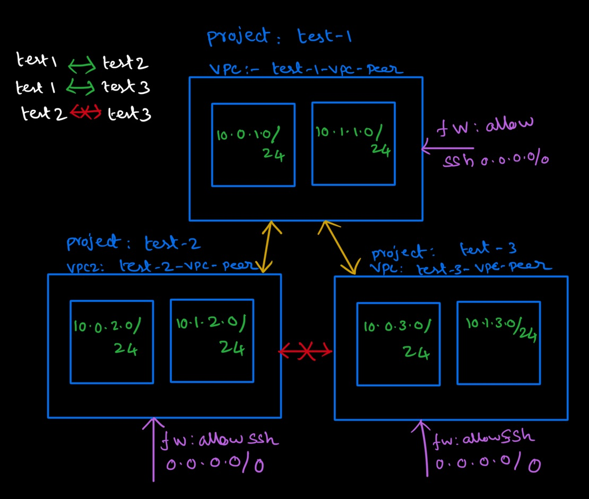
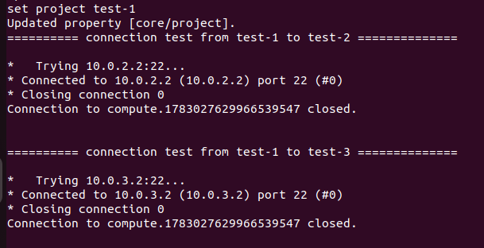
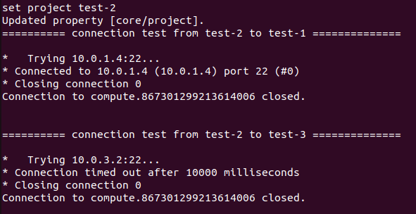
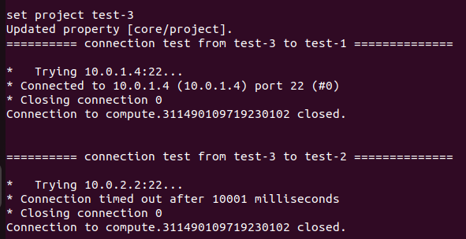

# VPC PEERING


## VPC Peering Setup



## VPC Peering Commands

|Project|Subnet-1|Subnet-2|
|--------------|------------|----------|
|test-1|10.0.1.0/24|10.1.1.0/24|
|test-2|10.0.2.0/24|10.1.2.0/24|
|test-3|10.0.3.0/24|10.1.3.0/24|

 
```
gcloud config set project test-1-348414

gcloud compute networks create test-1-vpc-peer --subnet-mode=custom

gcloud compute networks subnets create test-1-subnet-peer-asia-southeast1 --network=test-1-vpc-peer --region=asia-southeast1 --range=10.0.1.0/24

gcloud compute networks subnets create test-1-subnet-peer-asia-southeast2 --network=test-1-vpc-peer --region=asia-southeast2 --range=10.1.1.0/24

gcloud compute firewall-rules   create test-1-fw-ssh-allow-peer --direction=INGRESS --priority=1000 --network=test-1-vpc-peer --action=ALLOW --rules=tcp:22 --source-ranges=0.0.0.0/0

gcloud compute instances create test-1-ce-peer-poc --zone=asia-southeast1-a --machine-type=f1-micro --subnet=test-1-subnet-peer-asia-southeast1 --no-address


gcloud config set project test-2-348414

gcloud compute networks create test-2-vpc-peer --subnet-mode=custom

gcloud compute networks subnets create test-2-subnet-peer-asia-southeast1 --network=test-2-vpc-peer --region=asia-southeast1 --range=10.0.2.0/24

gcloud compute networks subnets create test-2-subnet-peer-asia-southeast2 --network=test-2-vpc-peer --region=asia-southeast2 --range=10.1.2.0/24

gcloud compute firewall-rules   create test-2-fw-ssh-allow-peer --direction=INGRESS --priority=1000 --network=test-2-vpc-peer --action=ALLOW --rules=tcp:22 --source-ranges=0.0.0.0/0

gcloud compute instances create test-2-ce-peer-poc --zone=asia-southeast1-a --machine-type=f1-micro --subnet=test-2-subnet-peer-asia-southeast1 --no-address


gcloud config set project test-3-348414

gcloud compute networks create test-3-vpc-peer --subnet-mode=custom

gcloud compute networks subnets create test-3-subnet-peer-asia-southeast1 --network=test-3-vpc-peer --region=asia-southeast1  --range=10.0.3.0/24

gcloud compute networks subnets create test-3-subnet-peer-asia-southeast2 --network=test-3-vpc-peer --region=asia-southeast2  --range=10.1.3.0/24

gcloud compute firewall-rules   create test-3-fw-ssh-allow-peer --direction=INGRESS --priority=1000 --network=test-3-vpc-peer --action=ALLOW --rules=tcp:22 --source-ranges=0.0.0.0/0

gcloud compute instances create test-3-ce-peer-poc --zone=asia-southeast1-a --machine-type=f1-micro --subnet=test-3-subnet-peer-asia-southeast1 --no-address
```

## VPC Run Test results

```shell
cd networking/vpc-peering
bash demo.sh
```

## VPC Peering Results






